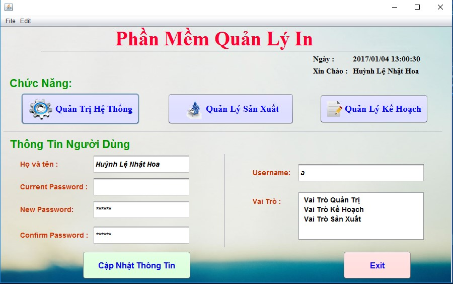
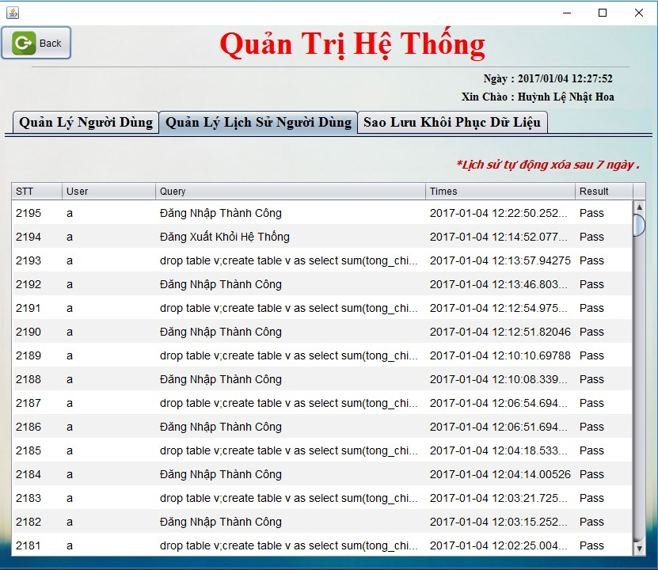
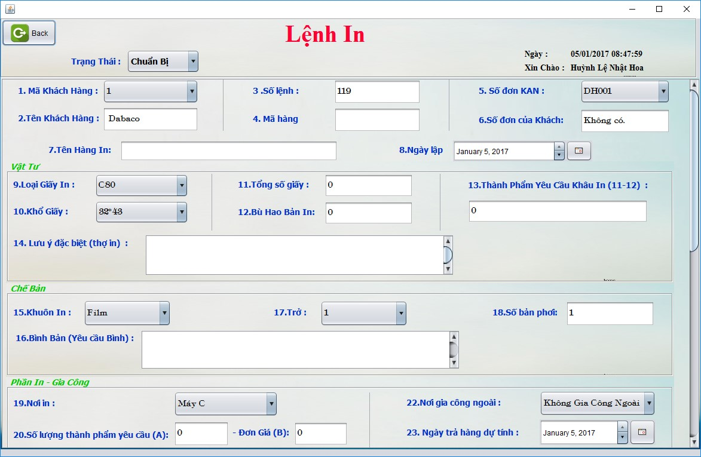
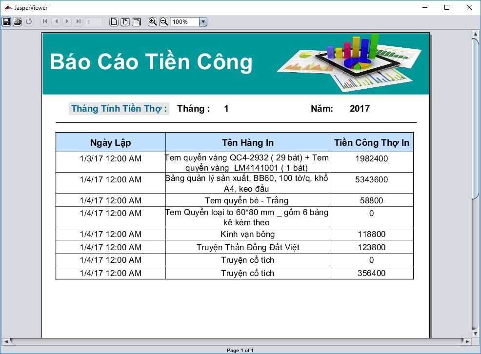

# Hệ thống quản lý nhà in

    

### Hệ thống quản lý nhà in, gồm 3 người dùng chính : Quản trị , Quán lý sản xuất và Quản lý kế hoạch 
### Chức năng chính: 
+ Sản xuất, Tạo lệnh in 
+ Quản lý tài nguyên, danh mục sản phẩm, vật liệu khách hàng.
+ Thống kê, bảng biểu theo tuần theo tháng.
  ....
  
  

    

    

    

    

